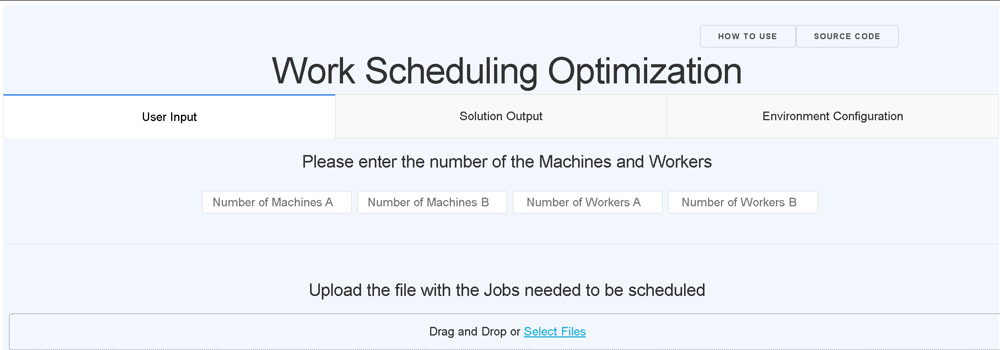
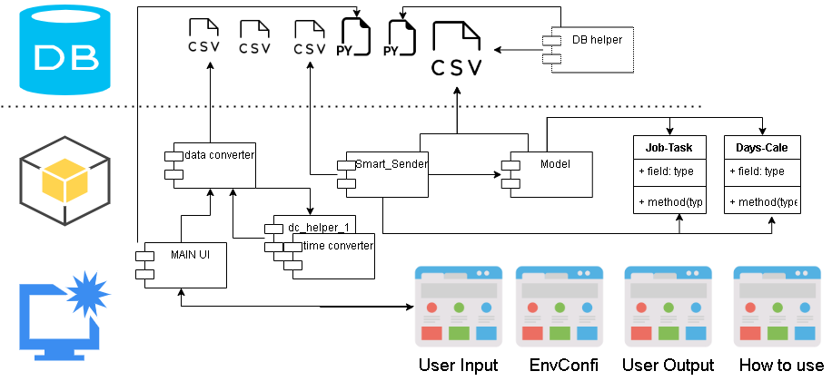
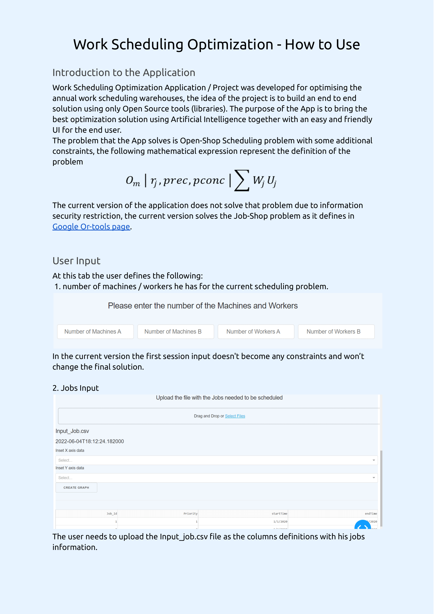
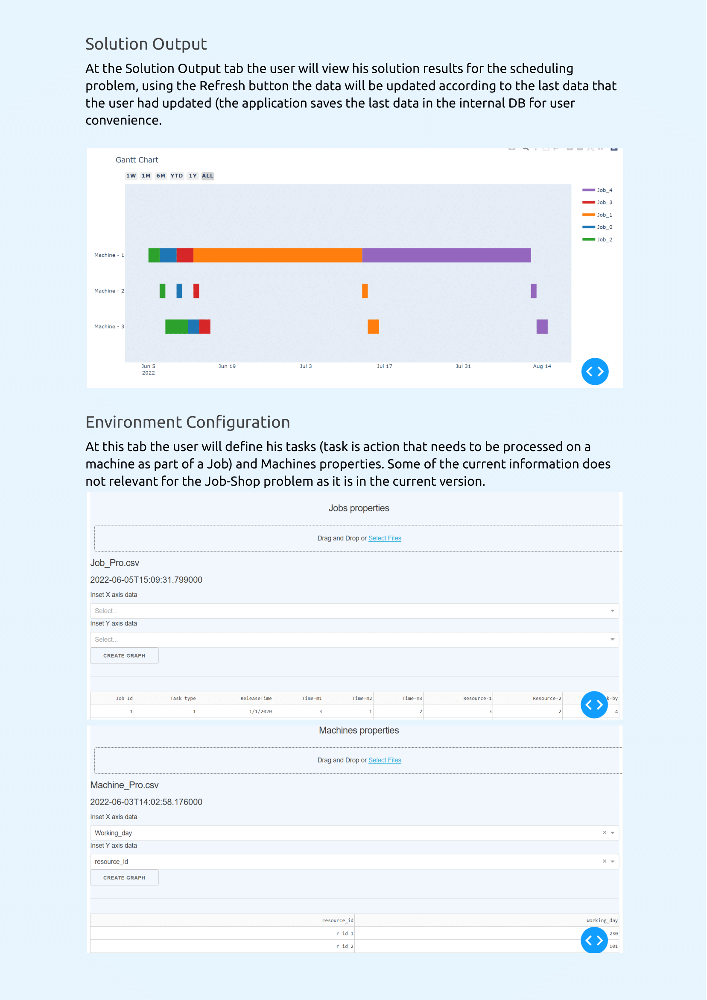

# Work Scheduling Optimization - WSO
WSO is an open source easy-to-use tool for work scheduling in complex environments.  
WSO uses Artificial Intelligence for solving hard to calculate problems. The solver seeks to find the best solution to a problem out of a very large set of possible solutions. 
WSO is easy to change and to adjust to your needs and to your work environment.

## System Design 
WSO software is divided into three parts:
1. User Interface
2. Software Modules
3. DataBase  

And each part have his own components
 

### User Interface 
this part is the end-user interface, the user can change the object properties such as Jobs and Machines.
the module that create that Application is `app.py`
### Software Modules 
this part is the end-user interface, the user can change the object properties such as Jobs and Machines.
the module that create that Application is 

| module | Description |
| ------ | ----------- |
| `input_converter`   | Converts the data from the user and aggregate it with the object properties to the data structure that the Solver can read.   The module use `time_converter` for date foramt data. |
| `time_converter` | Converts the time format to a format that the Solver can solve, this function convert date format such as 1/1/2020 to 202011 and can be calculated against other dates. |
| `smart_sender`    | Sends and get the data to the solver, the module can help to scale NP-Hard problem that will take the CP-SAT solver to much time to solve. |
| `jobshop_solver`    | Solved the Scheduling problem, the current solver is for solving Job-Shop problems. |

### DataBase
| files | Description |
| ------ | ----------- |
| `combine_data_from_user`   | Contains the aggregated data from the user with the properties of each object (Job / Machine) that the user configured. |
| `csv_from_user` | contains the all the data from the user with additional features that are required in the data structure for the Solver  |
| `pictures_for_md`    | Contains the PNG files for the `README.md` file |
| `how2use.pdf`    |Software Usage Guide, it can be downloaded also from the a button in the User Interface tab|
| `user_output_data.py`    | Contains the charts and the metadata for the `app.md` |

## Referents 

The application framework is based on [Dash Plotly](https://dash.plotly.com/introduction) package. 
The Solver of the SW is based on [CP-SAT](https://developers.google.com/optimization) OR-Tools Software Google AI.  

## How To Use

